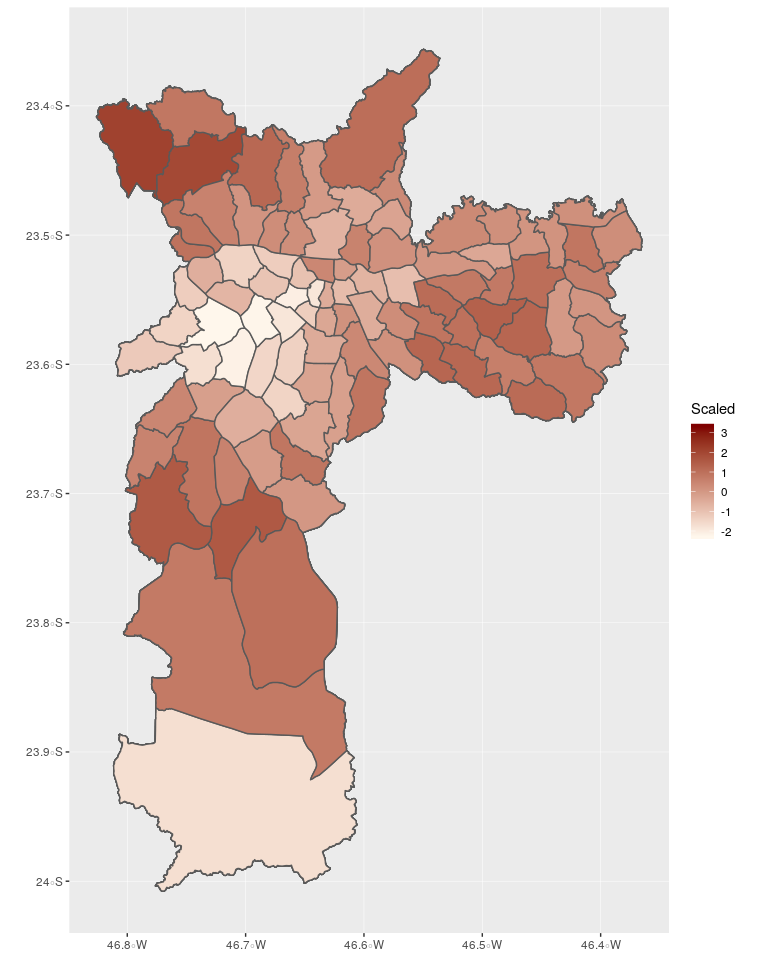
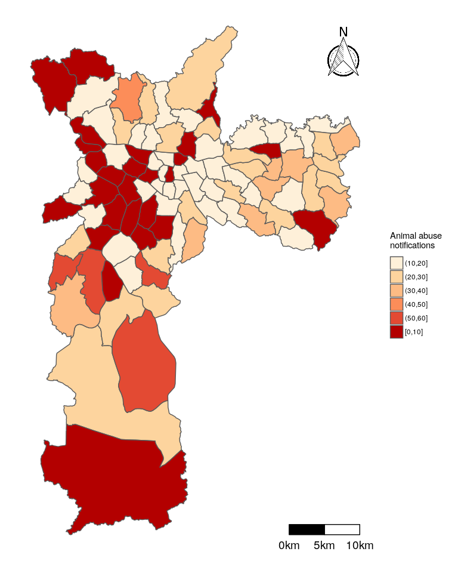
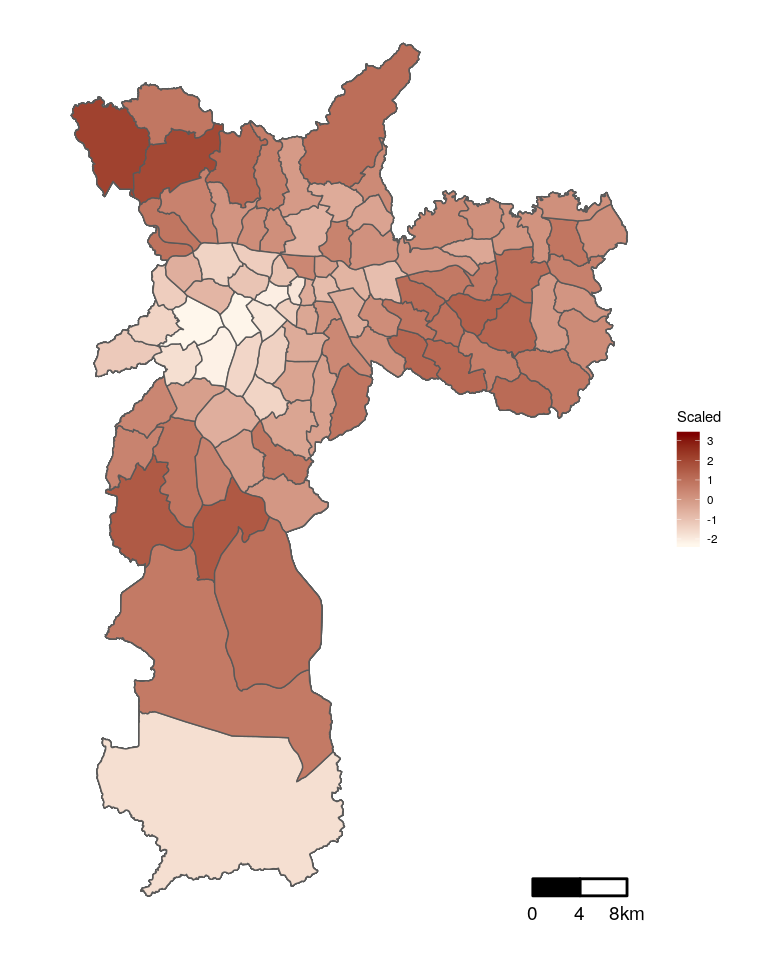
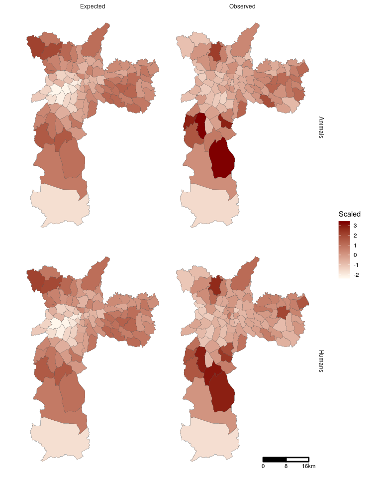
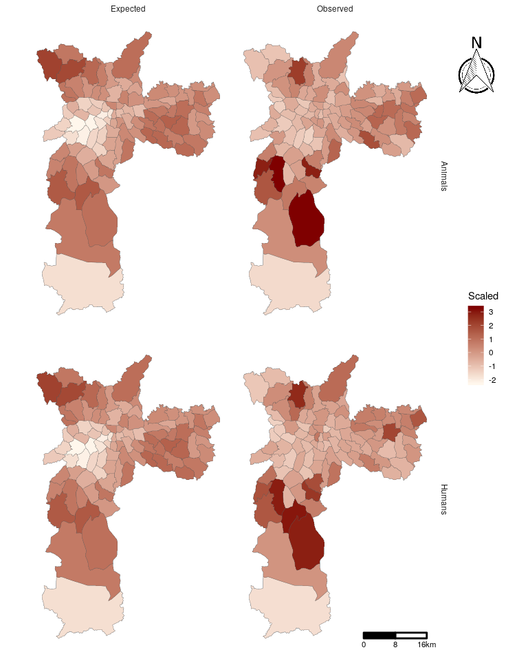
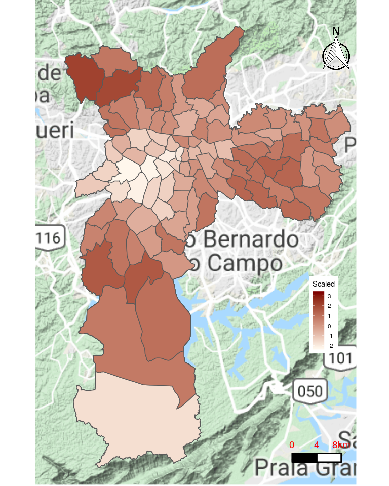
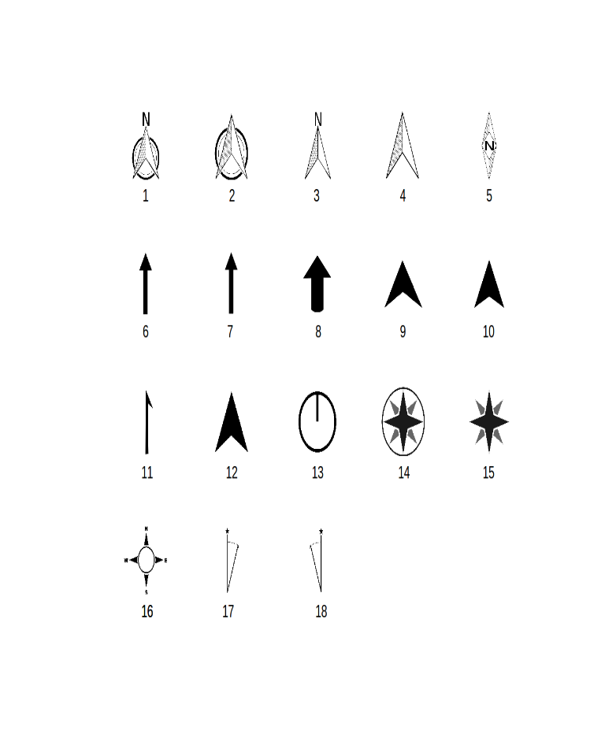

<!-- README.md is generated from README.Rmd. Please edit that file -->
The **ggsn** package improves the GIS capabilities of R, making possible to add 18 different north symbols and scale bars in kilometers, meters, nautical miles, or statue miles, to maps in geographic or metric coordinates created with **ggplot** or **ggmap**.

To install the CRAN version use:

``` r
install.packages('ggsn')
```

To install the development version use (make sure that **devtools** is installed):

``` r
devtools::install_github('oswaldosantos/ggsn')
```

Examples
--------

``` r
library(ggsn); library(ggplot2); library(sf)
data("domestic_violence")
```

**ggplot** map:

``` r
(ggm1 <- ggplot(domestic_violence, aes(fill = Scaled)) +
    geom_sf() +
    scale_fill_continuous(low = "#fff7ec", high = "#7F0000"))
```



Now, let's use the **ggsn** package to add a blank background, a north symbol and a scale bar with segments of 5km:

``` r
ggm1 +
    blank() +
    north(domestic_violence) +
    scalebar(domestic_violence, dist = 4, dist_unit = "km",
             transform = TRUE, model = "WGS84")
```



The scale bar works with maps in geographic and meter coordinates:

``` r
domestic_violence2 <- st_transform(domestic_violence, 31983)
ggplot(domestic_violence2, aes(fill = Scaled)) +
    geom_sf() +
    scalebar(domestic_violence2, dist = 4, dist_unit = "km",
             transform = FALSE, model = "WGS84") +
    blank() +
    scale_fill_continuous(low = "#fff7ec", high = "#7F0000")
```



With facet plots, choose the variable and level variable to plot the scalebar.

``` r
(fts <- ggplot(domestic_violence, aes(fill = Scaled)) +
  geom_sf(size = .1) +
  facet_grid(Type ~ Value) +
  scalebar(domestic_violence, dist = 8, dist_unit = "km", st.size = 3,
           transform = TRUE, model = "WGS84",
           facet.var = c("Type", "Value"),
           facet.lev = c("Humans", "Observed")) +
  theme_minimal() +
  blank() +
  scale_fill_continuous(low = "#fff7ec", high = "#7F0000"))
```



``` r
north2(fts, .9)
```



The packages **ggsn** and **ggmap** can be used together:

``` r
library(ggmap)
sp <- get_googlemap("São Paulo", zoom = 9, scale = 2)
ggmap(sp) +
    geom_sf(data = domestic_violence, aes(fill = Scaled),
            inherit.aes = F) +
    scalebar(x.min = -46.85, x.max = -46.38,
                   y.min = -24, y.max = -23.35,
                   dist = 4, dist_unit = "km",
                   st.bottom = FALSE, st.color = "red",
             transform = TRUE, model = "WGS84") +
    blank() +
    north(domestic_violence) +
    scale_fill_continuous(low = "#fff7ec", high = "#7F0000") +
    theme(legend.position = c(0.9, 0.35)) +
    xlim(-46.85, -46.38) +
    ylim(-24, -23.35)
```



To see the available north symbols, use:

``` r
northSymbols()
```



For more flexibility, read the functions' help pages.
