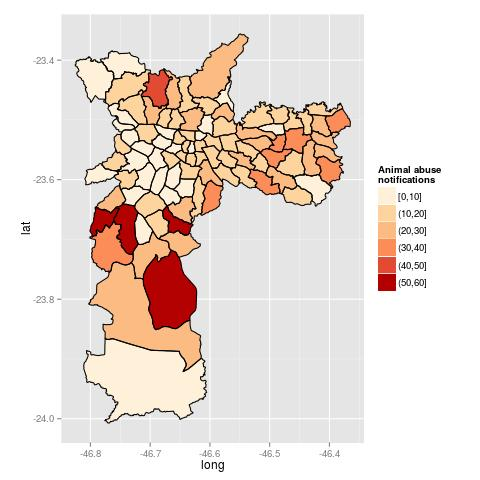
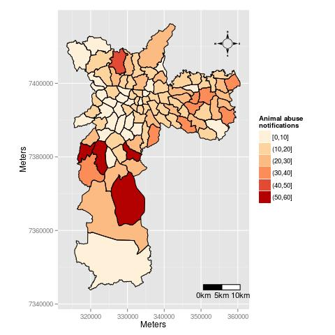
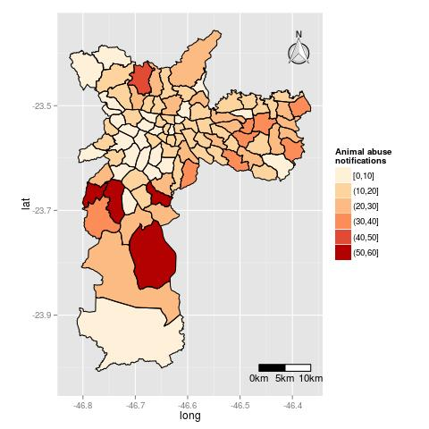
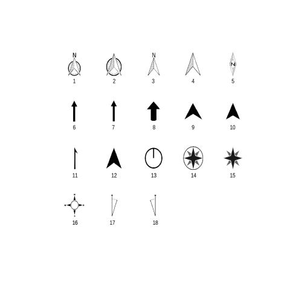

# ggsn
The ggsn package improves the GIS capabilities of R, making possible to add 18 different north symbols and scale bars in kilometers to maps in geographic or metric coordinates created with "ggplot" or "ggmap".  

To install the production version use: ̀ r install.packages('ggsn')̀
To install the production version use: ̀ r install_github('oswaldosantos/ggsn')̀  (make surethat devtools is loaded).

## Example

Read a shapefile and preprae it to plot
```{r}
library(ggsn); library(ggmap); library(rgdal); library(broom)
shape.directory <- system.file('extdata', package = 'ggsn')

# Map in geographic coordinates
map <- readOGR(shape.directory, 'sp')
map@data$id <- 1:nrow(map@data)
map.df <- merge(tidy(map), map, by = 'id')

# Map in projected coordinates
map2 <- spTransform(map, CRS("+init=epsg:31983"))
map2@data$id <- 1:nrow(map2@data)
map2.df <- merge(tidy(map2), map2, by = 'id')
```
ggplot map
```{r}
(ggm1 <- ggplot(data = map.df, aes(long, lat, group = group, fill = nots)) +
    geom_polygon() +
    coord_equal() +
    geom_path() +
    scale_fill_brewer(name = 'Animal abuse\nnotifications', palette = 8))
```


Now, let's use the ggsn package to add a blank background, a north symbol and a scaale bar with segments of 5km.

```{r}
ggm1 +
    blank() +
    north(map.df) +
    scalebar(map.df, dist = 5, dd2km = TRUE, model = 'WGS84')
```


The scale bar works with maps in geographic and meter coordinates.  

```{r}
ggm1 +
    blank() +
    north(map.df) +
    scalebar(map.df, dist = 5, dd2km = TRUE, model = 'WGS84')
```
```{r}
ggplot(data = map2.df, aes(long, lat, group = group, fill = nots)) +
    geom_polygon() +
    coord_equal() +
    geom_path() +
    north(map2.df, symbol = 16, scale = 0.15) +
    scale_fill_brewer(name = 'Animal abuse\nnotifications', palette = 8) +
    scalebar(map2.df, dist = 5) +
    xlab('Meters') +
    ylab('Meters')
```


The packages ggsn and ggmap can be used together.
```{r}
sp <- get_map(bbox(map) * matrix(rep(c(1.001, 0.999), e = 2), ncol = 2),
              source = 'osm')

ggmap(sp, extent = 'device') +
    geom_polygon(data = map.df, aes(long, lat, group = group, fill = nots),
                 alpha = .7) +
    coord_equal()+
    geom_path(data = map.df, aes(long, lat, group = group)) +
    scalebar(map.df, dist = 5, dd2km = T, model = 'WGS84') +
    north(map.df) +
    scale_fill_brewer(name = 'Animal abuse\nnotifications', palette = 8) +
    theme(legend.position = c(0.9, 0.35))
```


We have used default behaviors but we can change the position and size of the north symbol and the scale bar. For the scale bar, its hegiht, text size and text position can be controlled to. To see the available north symbols, use:

```{r}
symbols()
```

